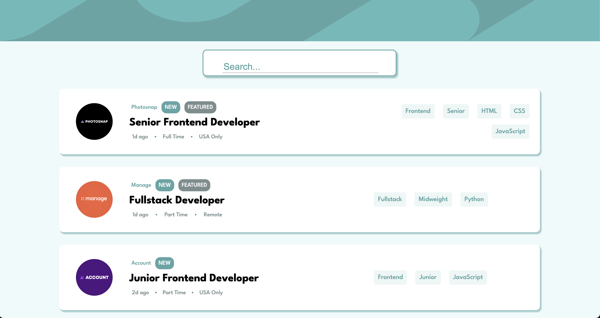

## Table of contents

- [Overview](#overview)
  - [Screenshot](#screenshot)
  - [Links](#links)
- [My process](#my-process)
  - [Built with](#built-with)
  - [What I learned](#what-i-learned)
  - [Continued development](#continued-development)
- [Acknowledgments](#acknowledgments)

## Overview

### Screenshot



### Links

- Live Site URL: [Demo](https://job-seekr.netlify.app/)

## My process

This project was a bit of a sandbox challenge for myself. I wanted to test out a few theories about filtering content. I had seen a long-winded way to conditionally render items based on user provided input but I felt like using the includes() method on an array might do the same thing with less lines of code.

I discovered this method while doing an online assessment where I was tasked with filtering content coming from an API. Though I am unable to upload that code, I can make my own version to study and employ in the future.

### Built with

- Semantic HTML5 markup
- CSS custom properties
- Flexbox
- Mobile-first workflow
- [React](https://reactjs.org/) - JS library
- [Next.js](https://nextjs.org/) - React framework
- [TailwindCSS](https://tailwindcss.com/) - For styles

### What I learned

I learned how to use a few javascript method like .includes() and .filter() to only render elements with those keywords. Of course you can view this component yourself but I wanted to highlight my solution. It relies on a bit on method chaining.

```js
{
  jobs
    .filter((job) => {
      const includesTitle = job.position
        .toLowerCase()
        .includes(filteredJobs.toLowerCase());
      const includesLevel = job.level
        .toLowerCase()
        .includes(filteredJobs.toLowerCase());

      if (filteredJobs === "") {
        return job;
      }
      if (includesLevel || includesTitle) {
        return job;
      }
    })
    .map((job, id) => {
      return (
        <div className="job" key={id}>
          
          <div className="job-center">
            <div className="job-top-description">
              <p>{job.company}</p>
              <p className="new">{job.new ? "NEW" : null}</p>
              <p className="featured">{job.featured ? "FEATURED" : null}</p>
            </div>
            <h1>{job.position}</h1>
            <div className="job-bottom-description">
              <p>{job.postedAt}</p>
              <p>•</p>
              <p>{job.contract}</p>
              <p>•</p>
              <p>{job.location}</p>
            </div>
          </div>
          <div className="tags">
            <p>{job.role}</p>
            <p>{job.level}</p>
            {job.languages.map((tag, index) => (
              <p key={index}>{tag}</p>
            ))}
          </div>
        </div>
      );
    });
}
```

### Continued development

I really wish to include an actual Job Boards API to render actual job postings but APIs of this nature are not free and usually cost a steep monthly fee. I would love to work with an API instead of hard coding my database.

## Acknowledgments

Thanks to FrontEndMentor and the Hatchaways program for inspiring this project.
